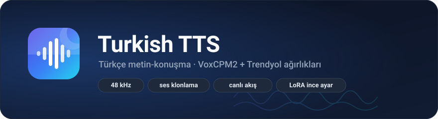

<p align="center">
  
</p>

<p align="center">
  <a href="https://pypi.org/project/turkish-tts/"></a>
  
  <a href="https://github.com/Boran-Sert/Turkish-TTS/actions/workflows/release.yml"></a>
  <a href="LICENSE"></a>
</p>

Türkçe metin-konuşma. Trendyol'un [VoxCPM2](https://github.com/OpenBMB/VoxCPM) üzerine ince
ayarladığı ağırlıkları üç şekilde sunar:

- **Kütüphane:** `TurkishTTS().save("Merhaba dünya.", "out.wav")`
- **Servis:** HTTP ve WebSocket, cümle cümle akan 48 kHz PCM16 ses
- **İnce ayar:** kendi veri setinizle LoRA eğitimi, tek fonksiyon çağrısıyla

Çıktı tek kanal, 16 bit, **48 kHz**.

## Gereksinimler

| Gereksinim | Değer |
|---|---|
| Python | 3.10+ |
| GPU | CUDA zorunlu. Model 2B parametre, upstream ~8 GB VRAM bildiriyor |
| Disk | Ağırlıklar için ~5 GB (Hugging Face önbelleğine iner) |

Servis GPU'suz açılmaz; `turkish-tts-server` net bir hata verip durur.

Ölçülen değerler (RTX 4060 Laptop, tek model, `benchmarks/baseline.json`):

| | eşzaman 1 | eşzaman 2 |
|---|---|---|
| İlk sese kadar (TTFB p50) | 341 ms | 4829 ms |
| RTF p50 | 1.045 | 1.809 |
| Verim (ses sn / duvar sn) | 0.96 | 1.01 |

Yükleme 14-20 s, üretim tepesinde ~5.7 GB VRAM. Eşzamanlı istek kapasitesi model örneği
sayısıyla sınırlı: ikinci istemci birincinin bitmesini bekler, bu yüzden p95 fırlar.
Upstream RTX 4090 için RTF ~0.30, hızlandırılmış runtime'larla ~0.13 bildiriyor
([karşılaştırma tablosu](src/turkish_tts/_vendor/voxcpm/README.upstream.md)). Kendi
donanımınızdaki değeri `benchmarks/bench.py` ile ölçün.

## Kurulum

```bash
git clone https://github.com/Boran-Sert/Turkish-TTS.git
cd Turkish-TTS

# CUDA'lı torch (varsayılan pip Windows'ta CPU tekerleğini çeker)
uv pip install torch torchaudio --index-url https://download.pytorch.org/whl/cu121

uv pip install -e .                 # yalnızca çıkarım
uv pip install -e ".[finetune]"     # ince ayar da gerekiyorsa

turkish-tts-fetch                   # ağırlıkları indir (~5 GB, bir kez)
```

`uv` yerine `pip` de çalışır; komutlardan `uv ` önekini kaldırın.

### Docker

```bash
docker compose -f docker/compose.yaml up
```

Ağırlıklar `hf-cache` volume'una iner, konteyner yeniden kurulsa da tekrar inmez. GPU
geçişi compose dosyasında tanımlı; ayarları `environment` altından verin.

## Kütüphane olarak

```python
from turkish_tts import TurkishTTS

tts = TurkishTTS()

tts.save("Merhaba, bugün nasılsınız?", "out.wav")       # WAV dosyası
pcm = tts.synthesize("Siparişiniz kargoya verildi.")     # ham PCM16-LE bytes

for chunk in tts.stream("Uzun bir metin. İkinci cümle."):  # cümle cümle akış
    hoparlore_yaz(chunk)

print(tts.sample_rate)   # 48000
print(tts.info())        # yüklenen model, cihaz, etkin ayarlar
```

Tamamı:

| Çağrı | Ne yapar |
|---|---|
| `tts.synthesize(text, voice=None)` | Ham PCM16-LE bayt döner |
| `tts.save(text, path, voice=None)` | WAV dosyası yazar |
| `tts.stream(text, voice=None)` | Cümle cümle PCM16 parçaları üretir |
| `tts.clone(text, reference)` | Metni referans kaydın sesiyle söyler |
| `tts.clone_to_file(text, reference, path)` | Aynısı, WAV'a yazar |
| `TurkishTTS.list_voices()` | Klonlanabilir sesleri listeler |
| `TurkishTTS.get_voice(name)` | Tek bir sesi getirir |
| `TurkishTTS.voices_directory()` | Seslerin okunduğu dizin |
| `TurkishTTS.finetune(dataset, out)` | LoRA ince ayarı başlatır |
| `TurkishTTS.check_dataset(dataset)` | Veri setini doğrular |
| `TurkishTTS.settings()` | Etkin ayarları döner |
| `TurkishTTS.reload_settings()` | Ayarları yeniden okur |
| `tts.info()` | Yüklenen model ve etkin ayarlar |
| `tts.sample_rate` | 48000 |

## Ses klonlama

Bir referans kayıt verip metni o sesle söyletebilirsiniz. Transkript gerekmez:

```python
tts.clone_to_file("Merhaba, nasılsınız?", "ornek.wav", "klon.wav")

# Her çağrıda ses seçmek
tts.save("Merhaba.", "out.wav", voice="ornek.wav")

# voices/ dizinindeki sesleri isimle kullanmak
for voice in TurkishTTS.list_voices():
    print(voice.name, voice.has_transcript)

tts.save("Merhaba.", "out.wav", voice="kadın")

# Varsayılan ses olarak sabitlemek
tts = TurkishTTS(voice="kadın")
```

Ses havuzu `voices_dir` ayarıyla belirlenir (varsayılan `voices/`). Bir `ornek.wav`
koyduğunuzda `voice="ornek"` olarak kullanılabilir hale gelir. Yanındaki `ornek.txt`
varsa transkript olarak okunur, ama klonlama **varsayılan olarak transkript
kullanmaz** — yalnızca ses tınısını taklit eder. Transkripti de kullanan "devam modu"
ancak metin gerçekten o kaydın dökümüyse doğru çalışır.

Model ilk `TurkishTTS()` çağrısında yüklenir; nesneyi saklayıp yeniden kullanın.

```python
tts = TurkishTTS(model_path="runs/benim-sesim")   # kendi ince ayarınız
tts = TurkishTTS(device="cuda:1")
```

## Servis olarak

```bash
turkish-tts-server          # 0.0.0.0:8000
```

`TTS_HOST` ve `TTS_PORT` ile adresi değiştirebilirsiniz. `http://localhost:8000/` basit bir
demo sayfası açar.

| Yol | Ne yapar |
|---|---|
| `GET /health` | Canlılık. Model yüklenirken de anında cevap verir |
| `GET /ready` | Hazırlık. Havuz yüklenene kadar 503 |
| `POST /v1/tts` | Metni sentezler, tam WAV döner |
| `POST /v1/tts/stream` | WAV başlığı, ardından üretildikçe PCM16 akışı |
| `WS /v1/tts/stream` | JSON kontrol çerçeveleri + ikili ses çerçeveleri, çok istekli |
| `GET /v1/voices` | Klonlama için kullanılabilir sesleri listeler |

```bash
curl -X POST localhost:8000/v1/tts \
  -H "Content-Type: application/json" \
  -d '{"text":"Merhaba dünya."}' -o out.wav
```

Protokolün tamamı, olay çerçeveleri ve C#/Java/Python/JavaScript istemci örnekleri:
[API_INTEGRATION_GUIDE.md](API_INTEGRATION_GUIDE.md).

Havuştaki bütün modeller meşgulse istek beklemez: HTTP **503**, WebSocket **1013** ile
kapanır. Eşik `pool_acquire_timeout_s`.

## Yapılandırma

Öncelik sırası: **ortam değişkeni > JSON dosyası > varsayılan.**

Ortam değişkenleri `TTS_<BÖLÜM>_<ALAN>` kalıbında. Liste ve sayı değerleri JSON olarak yazılır:

```bash
export TTS_MODEL_CFG_VALUE=2.0
export TTS_STREAMING_CHUNK_DURATION_MS=200
export TTS_SYSTEM_VOXCPM_GPU_IDS="[0,1]"
export TTS_LOG_LEVEL=DEBUG
```

JSON dosyası çalışma dizinindeki `tts_config.json`'dır; başka bir yol için `TTS_CONFIG_FILE`.

| Ayar | Varsayılan | Ne işe yarar |
|---|---|---|
| `model.model_path` | `./Trendyol-TTS` | Yerel dizin veya HF repo id'si |
| `model.inference_timesteps` | `8` | Difüzyon adımı. Artırmak kaliteyi ve maliyeti büyütür |
| `model.max_length` | `4096` | KV penceresi. Küçültmek adım maliyetini düşürür; üretim sınırının (4096) altına inmek riskli |
| `model.cfg_value` | `2.0` | Yönlendirme gücü. Model kartının önerdiği değer; büyütmek hızı değiştirmez |
| `streaming.chunk_duration_ms` | `200` | İlk sese kadar süreyi doğrudan belirler |
| `text_processing.min_chars` | `30` | Bu uzunluğun altındaki parçalar sonraki cümleye eklenir |
| `voices_dir` | `voices` | Klonlama için referans seslerin okunduğu dizin |
| `system.voxcpm_gpu_ids` | `[0]` | Her GPU için bir model örneği yüklenir |
| `system.use_torch_compile` | `true` | `torch.compile`. Triton yoksa sessizce atlanır |
| `system.pool_acquire_timeout_s` | `30` | Bu sürede GPU boşalmazsa 503 |
| `system.ws_idle_timeout_s` | `300` | Mesaj gelmeyen WebSocket bu sürede kapanır |
| `api.cors_allowed_origins` | `["*"]` | Üretimde daraltın |

Tablodaki değerler depodaki `tts_config.json` ile gelen değerlerdir ve
`benchmarks/` altındaki ölçümlerle seçilmiştir. `use_torch_compile` triton kurulu
olmayan ortamlarda sessizce etkisiz kalır. Kendi donanımınızda `benchmarks/bench.py`
ile ölçmeden değiştirmeyin.

Ayarlar import anında okunur; değişiklik yeniden başlatma gerektirir.

## İnce ayar

Trendyol'un ağırlıkları **zaten** genel Türkçe için ince ayarlı (20+ saat özel veri,
`Trendyol-TTS/merge_manifest.json`). Kendi ince ayarınız belirli bir **konuşmacı sesi**,
alan terminolojisi veya ton için anlam kazanır; genel Türkçe kalitesi için tekrar etmeye
gerek yok.

Veri seti satır başına bir JSON nesnesi (`examples/train_data_example.jsonl`):

```json
{"audio": "data/0001.wav", "text": "Merhaba, bugün nasılsınız?"}
{"audio": "data/0002.wav", "text": "Siparişiniz kargoya verildi.", "duration": 2.8}
```

`duration` isteğe bağlıdır; verirseniz filtreleme sırasında ses dosyası açılmaz.

```python
from turkish_tts import TurkishTTS, check_dataset

check_dataset("data/train.jsonl")        # önce doğrula: eksik wav, boş metin, süre

TurkishTTS.finetune(
    "data/train.jsonl",
    "runs/benim-sesim",
    val_dataset="data/val.jsonl",
    steps=2000,
    lora_rank=64,
)

tts = TurkishTTS(model_path="runs/benim-sesim")
```

`dry_run=True` verirseniz yalnızca veri seti doğrulanır, eğitim başlamaz. Varsayılanların
tamamı ve anlamları `FinetuneConfig` içinde; hepsi anahtar kelimeyle geçilebilir
(`learning_rate`, `batch_size`, `grad_accum_steps`, `lora_alpha`, `lora_target_dit`, ...).
Varsayılanlar Trendyol'un kullandığı değerlerdir. Eğitim bitince çıktı dizinine, hangi
veriden ve hangi ayarlarla üretildiğini kaydeden `finetune_manifest.json` yazılır.

İnce ayar `turkish-tts[finetune]` extra'sını gerektirir.

## Nasıl çalışır

```
istek -> VoxCPMPool.acquire()              GPU başına bir model örneği, timeout'lu kiralama
      -> sentence_source(text)             TextBuffer ile cümlelere bölme
      -> generate_stream_from_text_source  cümle cümle üretim
      -> AudioChunk akışı                  PCM16-LE, 48 kHz
```

Model örnekleri `acquire()` bağlamını **çağıran** tutar; ses üreticisinin içinde değil. Bu
yüzden istemci akışın ortasında koparsa model havuza her durumda geri döner. Eşzamanlılık
GPU sayısıyla sınırlıdır: VoxCPM2 toplu işlemeyi (batching) desteklemiyor, bir model aynı
anda bir istek üretir.

Gecikmenin büyük kısmı iki yerden gelir: `chunk_duration_ms` (ilk ses paketi için
biriktirilen süre) ve `inference_timesteps` × `cfg_value` (adım başına difüzyon maliyeti).

## Ölçüm

```bash
turkish-tts-server &
python benchmarks/bench.py --concurrency 1,2,4 --out benchmarks/baseline.json
python benchmarks/bench.py --compare benchmarks/baseline.json
```

TTFB (ilk sese kadar süre), RTF, p50/p95, verim ve tepe VRAM raporlanır. Rapora o anki
ayarlar da gömülür, çünkü sayılar ayarlar bilinmeden karşılaştırılamaz.

`benchmarks/before_optimization.json` ayar denemelerinden önceki durumu tutuyor; aradaki
fark `--compare` ile görülebilir (TTFB −%88, RTF −%50).

## Bilinen sınırlar

- **Toplu işleme yok.** Eşzamanlı kapasite GPU sayısı kadardır. Çok kiracılı yük için
  upstream'in işaret ettiği vLLM-Omni / Nano-vLLM runtime'ları değerlendirilmeli.
- **Kimlik doğrulama yok.** Servisi doğrudan internete açmayın; önüne bir ağ geçidi koyun.
- **Kuantizasyon yok.** GGUF/ONNX varyantları yalnızca harici projelerde mevcut.
- **Cümle bölme uç durumu:** bölme deseni metin sonunu da eşleştirdiği için token token
  besleme yapıldığında `"Prof. Dr."` gibi kısaltmalar yanlış bölünebilir. Metni tek
  seferde verdiğinizde sorun çıkmaz.

## Katkı

Geliştirme ortamı kurulumu, kod kuralları, commit biçimi ve yayın akışı:
[CONTRIBUTING.md](CONTRIBUTING.md).

## Lisans

Projenin kendi kodu Apache-2.0 ([LICENSE](LICENSE)). Vendor'lanmış VoxCPM de Apache-2.0,
Trendyol ağırlıkları MIT olarak etiketli. Üçüncü taraf bileşenlerin tamamı, yapılan
değişiklikler ve dikkat edilmesi gereken kısıtlar: [LICENSE-NOTICE.md](LICENSE-NOTICE.md).

Ağırlıkların eğitim verisi özeldir; Trendyol'un model kartı kullanım sorumluluğunu
geliştiriciye bırakıyor. Ses taklidi, izinsiz klonlama ve dolandırıcılık amaçlı kullanım
model kartında açıkça yasaklanmıştır.

---

## Son bir not

Açık olayım: burası benim asıl odaklandığım proje değil. Bunu, Türkçe için gerçekten iyi
çalışan ve üstüne rahatça bir şeyler kurulabilen bir TTS zemini olsun diye yazdım. Türk
geliştiricilerin elinin altında böyle bir şey bulunsun istedim.

Ayırabildiğim zaman sınırlı. Elimden geldiğince ilgileniyorum, ama tek başıma
büyütebileceğim bir iş değil. Burada sizin yardımınıza ihtiyacım var: bir hata
bulduysanız, eksik gördüğünüz bir yer varsa ya da "şurası daha iyi olabilirdi"
dediyseniz, o katkıyı bekliyorum. Küçük bir PR, açılmış bir issue, hatta bir öneri bile
projeyi ileri taşıyor.

Türk yazılım topluluğuna beraber bir şey bırakalım istiyorum. Proje işinize yaradıysa,
küçük de olsa desteğinizi esirgemeyin.
